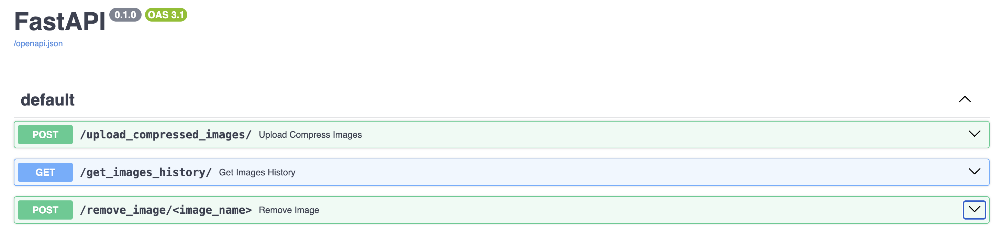
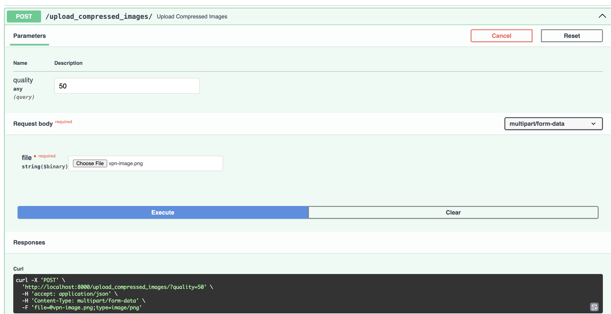
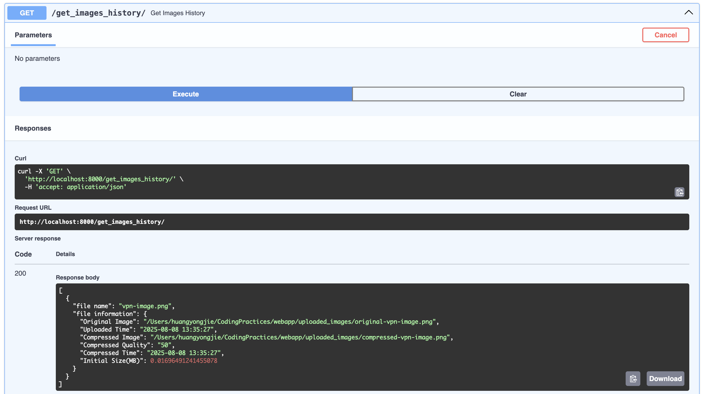
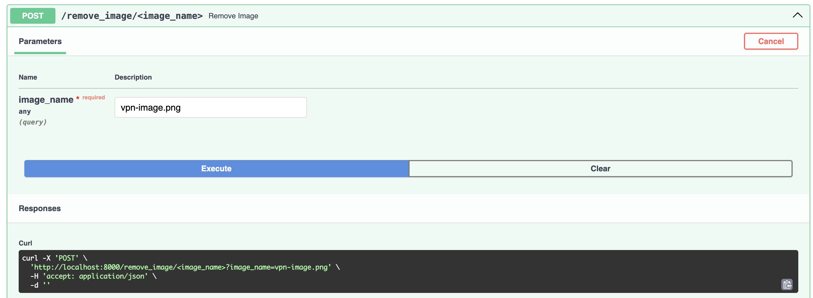
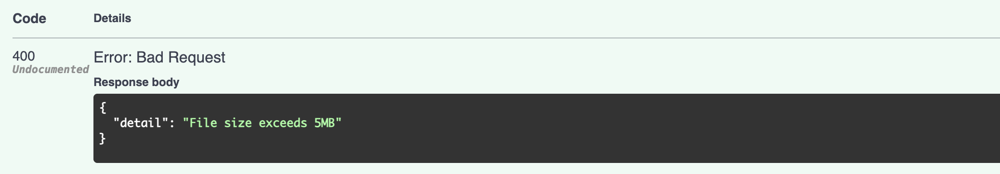
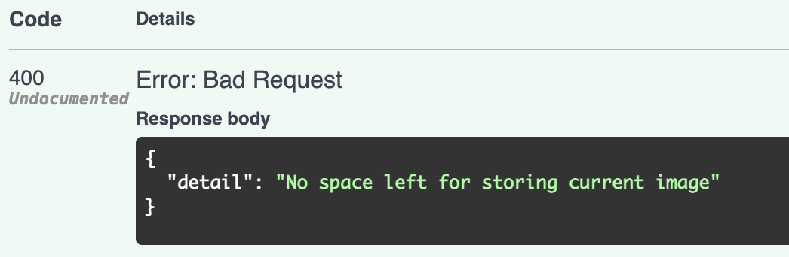

### Overview

This webapp is a FastAPI application which is used for uploading compressed images and query history images that had been uploaded previously.

In this webapp implementation, two endpoints have been created:
1. [POST] "/upload_compress_image"
- This endpoint is used for uploading and compressing images in certain quality.
- To avoid any traffic issues, the image size is limited to 10 MB.
- The remaining disk space needs to be checked, we will throw an exception and let users know what happens in this case.


2. [GET] "/get_images_history"
- This endpoint is used for retrieving images history, a JSON format string would be returned to users.
- The quality for image is 50% by default to save memory and disk spaces.


3. [POST] "/remove_image/<image_name>"
- This endpoint is used for deleting a specific image storing locally.


#### How to test?
1. Prepare virtual environment by executing "python -m venv .venv && source .venv/bin/activate".

2. Install Python libraries for FastAPI by running "pip install -r requirements.txt" within current virtual environment.

3. Start FastAPI locally by running "uvicorn main:app --reload" under folder webapp.

4. Go to browser and direct to http://localhost:8000/docs


5. Try these two endpoints (/upload_compressed_images/ and /get_images_history/) according to the indications with in the forms, one for uploading & compressing images and another for query history of images being uploaded.




6. After finishing tests, we can remove the images by callling endpoint "/remove_image/<image_name>" with the filenames in the output of "get_images_history" API call.

Before removing images,


Call API /get_images_history to remove specified image (both original and compressed images will be deleted!)


After removing images,


Check with the following example output for reference,


```
[
  {
    "file name": "vpn-image.png",
    "file information": {
      "Original Image": "/Users/huangyongjie/CodingPractices/webapp/uploaded_images/original-vpn-image.png",
      "Uploaded Time": "2025-08-08 10:43:01",
      "Compressed Image": "/Users/huangyongjie/CodingPractices/webapp/uploaded_images/compressed-vpn-image.png",
      "Compressed Quality": "50",
      "Compressed Time": "2025-08-08 10:43:01",
      "Initial Size(MB)": 0.01696491241455078
    }
  }
]
```
Please be notified that no output will be returned after rebooting FastAPI server because the data is in memory and not persistent.


### Corner Cases:
1. Size exceeds the limitation (5MB).

2. No space left on the device (Mock testing).

